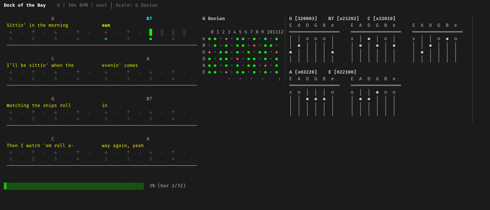

# Backing Tracks - v0.6

A terminal-based backing track player that uses the BTML (Backing Track Markup Language) DSL. Generate complete backing tracks with chords, bass, drums, and auto-generated melodies with real-time scale visualization!

## What Works

 - ✅ Parse YAML-based BTML files
 - ✅ Display track info and chord progressions in terminal
 - ✅ Generate MIDI files from chord progressions
 - ✅ **Bass line generation** (root, root_fifth, walking, swing_walking, stride, boogie)
 - ✅ **Drum patterns** (rock_beat, shuffle, jazz_swing, kick_only)
 - ✅ **Rhythm styles** (strumming, fingerpicking, travis, arpeggio, stride, ragtime)
 - ✅ **Euclidean rhythms** for algorithmic drum patterns
 - ✅ **Live visual display** - shows current chord, beat, scale fretboard, and chord charts!
 - ✅ **Auto-generated melody** - improvisation based on scale and style
 - ✅ **Guitar fretboard display** - shows scale positions for soloing
 - ✅ **Chord chart display** - shows finger positions for current chord
 - ✅ **Strudel export** - export to Strudel live coding format
 - ✅ Play backing tracks via FluidSynth (when installed)

**Supported Styles**: Rock, Blues, Jazz, Folk, Funk, Ska, Reggae, Country, Disco, Motown/Soul, Flamenco, EDM, Trap, Ragtime, Stride, Boogie-Woogie. See [MUSIC_STYLES.md](MUSIC_STYLES.md) for music theory and implementation details.

## Why BTML?

Unlike commercial backing track software (iReal Pro, ChordPulse, Band-in-a-Box), BTML is designed for the AI era:

| Feature | BTML | Commercial Apps |
|---------|------|-----------------|
| **LLM-friendly** | ✅ Plain YAML, easily generated by AI | ❌ GUI-only, proprietary formats |
| **Version control** | ✅ Text files, git-friendly | ❌ Binary or database formats |
| **Scriptable** | ✅ CLI-based, pipeable | ❌ Manual interaction required |
| **Open source** | ✅ Fully customizable | ❌ Closed source |
| **No subscription** | ✅ Runs locally with FluidSynth | ⚠️ Often subscription-based |
| **Algorithmic rhythms** | ✅ Euclidean patterns | ❌ Fixed presets only |

### AI Generation Example

Ask any LLM to generate a backing track:

> *"Create a slow blues in A with walking bass and shuffle drums"*

```yaml
track:
  title: "Slow Blues in A"
  key: A
  tempo: 70
  style: blues

chord_progression:
  pattern: "A7 A7 A7 A7 D7 D7 A7 A7 E7 D7 A7 E7"

bass:
  style: walking

drums:
  style: shuffle
```

The YAML format is in LLM training data, making generation reliable. No GUI clicking, no manual entry - just pipe the output to a file and play.

### Sheet Music to Backing Track in 30 Seconds

With Claude Desktop, you can go from a **photo of sheet music** to a **playing backing track** in under 30 seconds:

1. **Take a photo** of sheet music, lead sheet, or chord chart
2. **Upload to Claude Desktop** with the [project instructions](CLAUDE_DESKTOP_PROJECT.md)
3. **Claude extracts** key, tempo, chords, and song structure
4. **Save the BTML** and play immediately

```
📷 Photo of sheet music
       ↓
🤖 Claude Desktop (vision + BTML generation)
       ↓
📄 song.btml
       ↓
🎵 ./backing-tracks play song.btml
```

**No other software offers this workflow.** Traditional approaches require:
- Sheet music OCR → manual cleanup → DAW import → manual arrangement
- Or: manually entering chords into Band-in-a-Box / iReal Pro

With BTML + Claude, the LLM understands musical context, infers missing information, and outputs a ready-to-play backing track. See [CLAUDE_DESKTOP_PROJECT.md](CLAUDE_DESKTOP_PROJECT.md) for setup instructions.

## Installation

### 1. Build the Application

```bash
go build -o backing-tracks
```

### 2. Install FluidSynth and SoundFont

**Ubuntu/Debian:**
```bash
sudo apt install fluidsynth fluid-soundfont-gm
```

**Arch Linux:**
```bash
sudo pacman -S fluidsynth soundfont-fluid
```

**macOS:**
```bash
brew install fluid-synth
```

## Usage

```bash
# Play a backing track
./backing-tracks play examples/blues-full.btml

# Export to MIDI file
./backing-tracks export examples/blues-full.btml output.mid

# Export to Strudel (live coding)
./backing-tracks strudel examples/blues-full.btml output.strudel.js
```

### Live Display

During playback, you'll see:
- Current chord displayed prominently (with transpose indicator)
- Visual metronome with beat indicators
- Strum pattern visualization
- **Scale fretboard** showing positions for improvisation
- **Chord tones fretboard** showing all positions for current chord notes
- **Chord diagrams** with finger positions
- Track mute status indicators
- Progress bar through the progression

**Playback Controls:**
| Key | Action |
|-----|--------|
| `Space` | Pause / Resume |
| `←` / `→` | Jump to previous / next bar |
| `↑` / `↓` | Transpose up / down by semitone (audio + display) |
| `Shift+↑` / `Shift+↓` | Speed up / slow down by 5 BPM |
| `[` / `]` | Move capo down / up (transposes audio + display) |
| `{` / `}` | Move visual capo down / up (display only, no audio change) |
| `<` / `>` | Cycle through guitar tunings |
| `Shift+1-9` | Loop current bar + next N-1 bars (press again to disable) |
| `1` | Toggle drums mute |
| `2` | Toggle bass mute |
| `3` | Toggle chords mute |
| `4` | Toggle melody mute |
| `Q` / `Esc` | Quit |



## BTML File Format

Create `.btml` files using simple YAML syntax:

```yaml
track:
  title: "Slow Blues in A (Full Band)"
  key: A
  tempo: 80
  time_signature: 4/4
  style: blues
  capo: 0                # Capo position (0 = no capo)

chord_progression:
  pattern: "A7 A7 A7 A7 D7 D7 A7 A7 E7 D7 A7 E7"
  bars_per_chord: 1
  repeat: 2

rhythm:
  style: shuffle_strum
  swing: 0.6
  instrument: steel_guitar    # Optional: GM instrument name

bass:
  style: swing_walking
  swing: 0.6
  instrument: fingered_bass   # Optional: GM instrument name

drums:
  style: shuffle
  intensity: 0.7

melody:
  enabled: true
  style: simple      # simple, moderate, active
  density: 0.5       # 0.0 to 1.0
```

## Supported Features

### Chord Progressions

**Basic Pattern:**
```yaml
chord_progression:
  pattern: "C G Am F"
  bars_per_chord: 2
  repeat: 4
```

**Inline Duration Notation:**
```yaml
chord_progression:
  pattern: "C*2 G*1 Am*2 F*1"  # C for 2 bars, G for 1 bar, etc.
```

**Sections & Form** (for complex songs):
```yaml
sections:
  - name: verse
    chord_progression:
      pattern: "C G Am F"
  - name: chorus
    chord_progression:
      pattern: "F G C Am"

form:
  - verse
  - verse
  - chorus
  - verse
  - chorus
```

### Chord Types
- **Major triads**: C, D, E, F, G, A, B
- **Minor triads**: Cm, Dm, Em, Am, etc.
- **Dominant 7th**: C7, D7, E7, A7, etc.
- **Major 7th**: Cmaj7, Dmaj7, Fmaj7, etc.
- **Minor 7th**: Cm7, Dm7, Em7, Am7, etc.
- **Suspended**: Csus4, Dsus2, etc.
- **Power chords**: C5, D5, E5, etc.

### Rhythm Styles

| Style | Description | Best For |
|-------|-------------|----------|
| `whole` | One strum per bar | Slow ballads |
| `half` | Two strums per bar | Ballads |
| `quarter` | Four strums per bar | Pop, rock |
| `eighth` | Eight strums per bar | Rock, punk |
| `sixteenth` | 16th note strumming | Funk, disco |
| `funk_16th` | Funky 16ths with ghost notes | Funk, R&B |
| `funk_muted` | Heavily muted funk | Funk rock |
| `strum_down` | Arpeggiated downstrum | Folk |
| `strum_up_down` | Alternating strums | Pop, rock |
| `folk` | Bass note + chord pattern | Folk, country |
| `shuffle_strum` | Triplet shuffle | Blues |
| `travis` | Travis picking pattern | Country, folk |
| `fingerpick` | Folk fingerpicking | Singer-songwriter |
| `fingerpick_slow` | Sparse fingerpicking | Ballads |
| `pima` | P-i-m-a ascending pattern | Classical, folk |
| `pima_reverse` | P-a-m-i descending pattern | Classical, ballads |
| `classical` | P-i-m-i-a-i-m-i full pattern | Classical guitar |
| `banjo_roll` | Forward roll (T-I-M) | Bluegrass, country |
| `pinch` | Bass + treble pinch | Folk, country |
| `dust_in_wind` | Continuous 16th notes | Kansas-style ballads |
| `landslide` | Fleetwood Mac style | Folk rock |
| `blackbird` | Walking bass fingerpicking | Beatles-style |
| `arpeggio_up` | Ascending arpeggio | Classical, ambient |
| `arpeggio_down` | Descending arpeggio | Classical, ballads |
| `stride` | Chords on 2 & 4 | Ragtime, stride piano |
| `ragtime` | Stride with syncopation | Ragtime |

### Instruments

Override the default instrument for any section:

```yaml
rhythm:
  style: fingerpick
  instrument: nylon_guitar
```

| Category | Instruments |
|----------|-------------|
| **Pianos** | `piano`, `electric_piano`, `honky_tonk`, `harpsichord` |
| **Guitars** | `nylon_guitar`, `steel_guitar`, `jazz_guitar`, `clean_guitar`, `overdrive`, `distortion` |
| **Bass** | `acoustic_bass`, `fingered_bass`, `picked_bass`, `fretless_bass`, `slap_bass`, `synth_bass` |
| **Strings** | `violin`, `cello`, `strings`, `contrabass` |
| **Brass** | `trumpet`, `trombone`, `brass`, `french_horn` |
| **Woodwinds** | `alto_sax`, `tenor_sax`, `clarinet`, `flute` |
| **Organ** | `organ`, `church_organ`, `accordion`, `harmonica` |

### Guitar Tunings

Set alternate tunings for accurate fretboard display:

```yaml
track:
  title: "Drop D Song"
  tuning: drop_d
```

| Tuning | Notes | Use Case |
|--------|-------|----------|
| `standard` | E A D G B e | Default |
| `drop_d` | D A D G B e | Foo Fighters, Rage Against the Machine |
| `drop_c` | C G C F A d | Heavy metal |
| `d_standard` | D G C F A d | Slightly lower, Nirvana |
| `eb_standard` | Eb Ab Db Gb Bb eb | Half step down, SRV, GnR |
| `open_e` | E B E G# B e | Slide blues, Black Crowes |
| `open_d` | D A D F# A d | Slide, Joni Mitchell |
| `open_g` | D G D G B d | Keith Richards, Rolling Stones |
| `open_a` | E A E A C# e | Slide blues |
| `dadgad` | D A D G A d | Celtic, Pierre Bensusan |
| `open_c` | C G C G C e | Devin Townsend |

### Bass Styles

| Style | Description | Best For |
|-------|-------------|----------|
| `root` | Root notes on downbeats | Simple accompaniment |
| `root_fifth` | Root on 1, fifth on 3 | Folk, country, rock |
| `walking` | Root, 3rd, 5th, 7th pattern | Jazz |
| `swing_walking` | Swung walking bass | Jazz, blues |
| `stride` | Low bass on 1 & 3 | Ragtime, stride piano |
| `boogie` | Driving eighth note pattern | Boogie-woogie, rock & roll |

### Drum Patterns

**Preset Styles:**
| Style | Description |
|-------|-------------|
| `rock_beat` | Kick 1,3 / Snare 2,4 / 8th hihat |
| `shuffle` | Blues shuffle with triplet feel |
| `jazz_swing` | Swinging ride with sparse kick/snare |
| `kick_only` | Just kick drum (for stripped-down tracks) |

**Euclidean Rhythms:**
```yaml
drums:
  kick:
    euclidean: { hits: 5, steps: 8, rotation: 0 }
  snare:
    euclidean: { hits: 3, steps: 8, rotation: 2 }
  hihat:
    euclidean: { hits: 7, steps: 8, rotation: 0 }
```

### Melody Generation

Auto-generate an improvisation track:

```yaml
melody:
  enabled: true
  style: simple      # simple (half notes), moderate (quarters), active (eighths)
  density: 0.5       # 0.0 to 1.0 - how many notes to play
```

The melody uses scale-appropriate notes based on the track style:
- **Blues** → Blues scale
- **Jazz** → Dorian/Mixolydian modes
- **Rock** → Pentatonic minor
- **Folk/Pop** → Natural major/minor

### Scale Override

Force a specific scale instead of auto-detection:

```yaml
scale:
  type: blues  # pentatonic_minor, pentatonic_major, blues, dorian, mixolydian, natural_minor, natural_major
```

## Example Tracks

The `examples/` directory contains many demo tracks:

### Blues Styles
| File | Description |
|------|-------------|
| `blues-full.btml` | Full band blues with swing walking bass |
| `blues-delta.btml` | Raw, sparse Delta blues (72 BPM) |
| `blues-chicago.btml` | Electric Chicago shuffle (116 BPM) |
| `blues-texas.btml` | Clean, jazzy Texas blues (126 BPM) |
| `blues-jump.btml` | Uptempo jump blues (168 BPM) |
| `blues-slow.btml` | Soulful slow blues (58 BPM) |
| `blues-west-coast.btml` | Jazzy West Coast blues (96 BPM) |
| `blues-boogie.btml` | John Lee Hooker style one-chord boogie |

### Fingerpicking
| File | Description |
|------|-------------|
| `fingerpick-travis.btml` | Travis picking in G (country/folk) |
| `fingerpick-folk.btml` | Classic folk fingerpicking |
| `fingerpick-ballad.btml` | Slow ballad fingerpicking |
| `fingerpick-arpeggio.btml` | Classical ascending arpeggios |
| `fingerpick-spanish.btml` | Spanish romance style |
| `fingerpick-songwriter.btml` | Singer-songwriter style |

### Ragtime & Boogie
| File | Description |
|------|-------------|
| `ragtime.btml` | Classic stride piano ragtime |
| `boogie-woogie.btml` | Driving boogie-woogie piano |
| `rock-n-roll-piano.btml` | 50s rock & roll (Jerry Lee Lewis style) |

### Other Styles
| File | Description |
|------|-------------|
| `pop-full.btml` | Pop with bass & drums |
| `rock-euclidean.btml` | Rock with Euclidean drum patterns |
| `jazz-swing.btml` | Jazz II-V-I with walking bass |
| `little-wing.btml` | Ballad in Em |

Try them:
```bash
./backing-tracks play examples/blues-chicago.btml
./backing-tracks play examples/fingerpick-travis.btml
./backing-tracks play examples/ragtime.btml
./backing-tracks play examples/rock-n-roll-piano.btml
```

## Project Structure

```
backing-tracks/
├── main.go              # CLI entry point
├── parser/
│   └── parser.go        # BTML YAML parser
├── midi/
│   ├── generator.go     # MIDI file generation
│   ├── bass.go          # Bass pattern generator
│   ├── drums.go         # Drum pattern generator
│   ├── rhythm.go        # Chord rhythm patterns
│   └── melody.go        # Melody generation
├── player/
│   └── fluidsynth.go    # FluidSynth integration
├── display/
│   ├── terminal.go      # Terminal display formatting
│   ├── live.go          # Real-time playback display
│   ├── fretboard.go     # Guitar fretboard visualization
│   └── chords.go        # Chord diagram display
├── theory/
│   └── theory.go        # Music theory (scales, keys)
├── strudel/
│   └── generator.go     # Strudel export
├── examples/            # Example BTML files
└── README.md
```

## Roadmap

- **v0.1:** ✅ Basic chord progression playback
- **v0.2:** ✅ Bass line generation
- **v0.3:** ✅ Drum patterns (presets + Euclidean rhythms)
- **v0.4:** ✅ Live visual display with chord and beat tracking
- **v0.5:** ✅ Scale display, chord charts, melody generation, Strudel export
- **v0.6:** ✅ 16th note rhythms, Bubbletea TUI
- **v0.7:** Mini-notation parser (Strudel-inspired)
- **v0.8:** LLM integration for generating BTML from songs

## Dependencies

**Go Libraries:**
- `gopkg.in/yaml.v3` - YAML parsing
- `gitlab.com/gomidi/midi/v2` - MIDI file generation
- `github.com/charmbracelet/bubbletea` - Terminal UI framework
- `github.com/charmbracelet/lipgloss` - Terminal styling

**External:**
- FluidSynth - Audio synthesis

## Troubleshooting

### "fluidsynth not found"
Install FluidSynth: `sudo apt install fluidsynth fluid-soundfont-gm`

### "no SoundFont (.sf2) file found"
Install a SoundFont package: `sudo apt install fluid-soundfont-gm`

### No audio output
Check your system audio settings and ensure FluidSynth can access your audio device.

## License

MIT

## Contributing

Contributions welcome! See:
- `BTML_MANUAL.md` for the full BTML specification
- `MUSIC_STYLES.md` for music theory and style implementation details
- `CLAUDE.md` for development guidelines

## What's New

**v0.6 (Current)**
- ✅ **Real-time playback controls**: Pause/resume (space), seek (←/→)
- ✅ **Transpose controls**: Shift song up/down by semitones (↑/↓)
- ✅ **Capo support**: Set capo in BTML file or adjust live with [/] keys
- ✅ **Instrument selection**: Choose GM instruments per section (nylon_guitar, slap_bass, etc.)
- ✅ **Sections & Form**: Define verse/chorus/bridge sections, specify song structure
- ✅ **Guitar tunings**: Drop D, Open E, Open G, DADGAD, and more
- ✅ **Track mute controls**: Mute individual tracks with keys 1-4
- ✅ **Chord tones fretboard**: Shows all positions for current chord notes
- ✅ **Synced audio & display**: Controls affect both sound and visuals
- ✅ **Multi-chord bar display**: Shows "Am7 → Am" for half-bar chords
- ✅ **Pattern list support**: Chord patterns can be YAML lists
- ✅ **16th note rhythm styles**: `sixteenth`, `funk_16th`, `funk_muted`
- ✅ **Bubbletea TUI**: Proper terminal UI with Lipgloss styling
- ✅ **Beat subdivision display**: Shows "1 e + a 2 e + a..." for 16th notes
- ✅ **TTY detection**: Falls back to legacy display in non-terminal environments

**v0.5**
- ✅ **Guitar fretboard display** showing scale positions for improvisation
- ✅ **Chord chart display** with finger positions (open + barre voicings)
- ✅ **Auto-generated melody track** based on scale and chord tones
- ✅ **Smart scale detection** based on track style (blues, jazz, rock, etc.)
- ✅ **Strudel export** for live coding
- ✅ **New rhythm styles**: stride, ragtime, fingerpicking variants
- ✅ **New bass styles**: stride, boogie
- ✅ **Many new examples**: blues styles, fingerpicking, ragtime, boogie-woogie

**v0.4**
- ✅ Live visual display during playback
- ✅ Inline duration notation for chords
- ✅ Karaoke-style scrolling display with lyrics support

**v0.3**
- ✅ Bass line generation (4 styles)
- ✅ Drum patterns (3 presets + Euclidean)
- ✅ Swing feel for bass

**v0.2**
- ✅ Bass line generation (initial)

**v0.1**
- ✅ Chord progression playback
- ✅ FluidSynth integration
