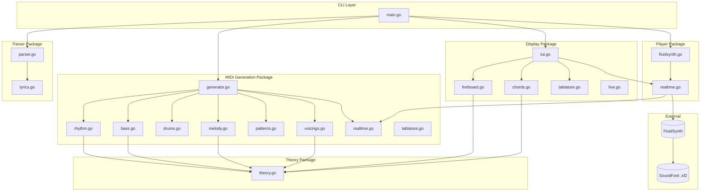
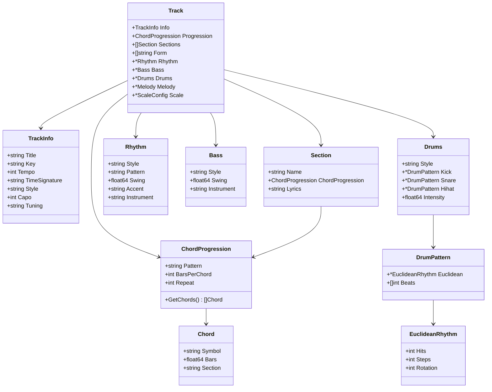
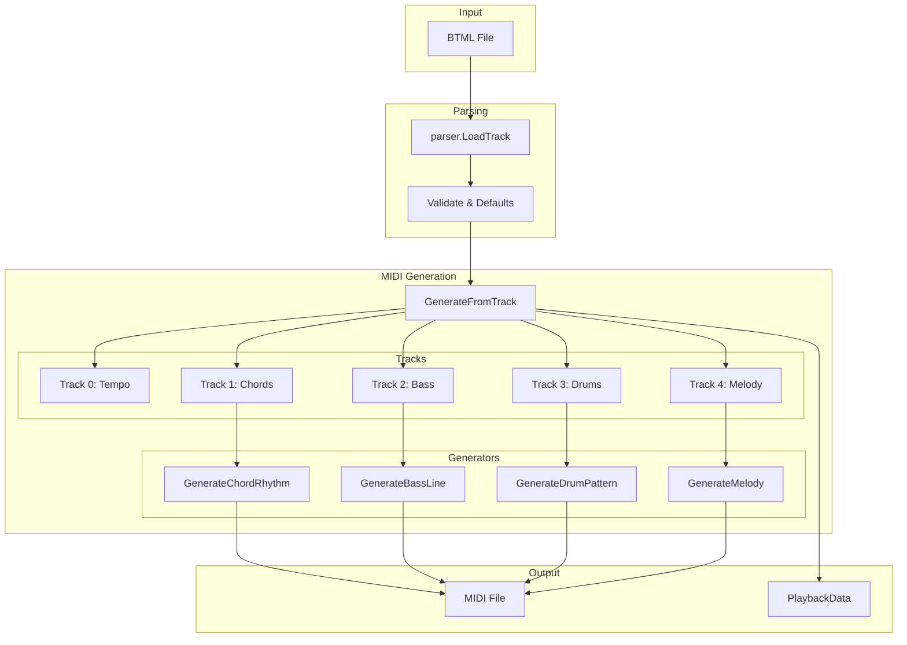
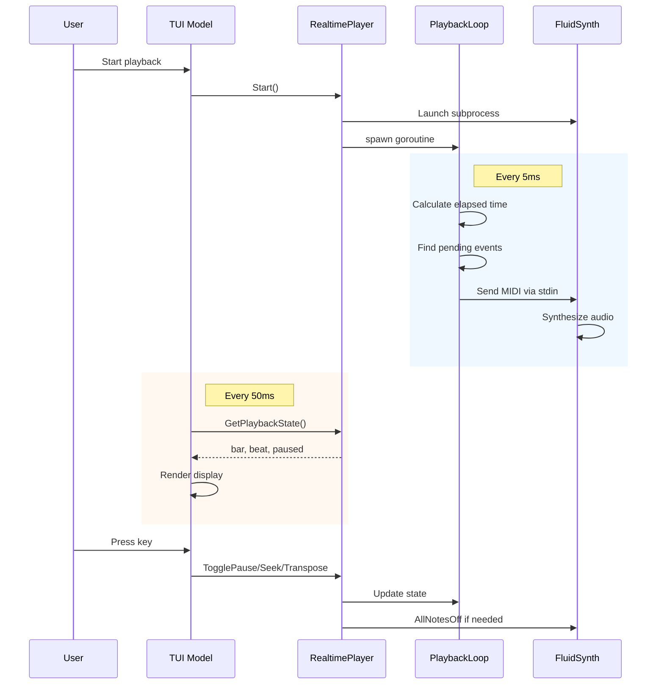
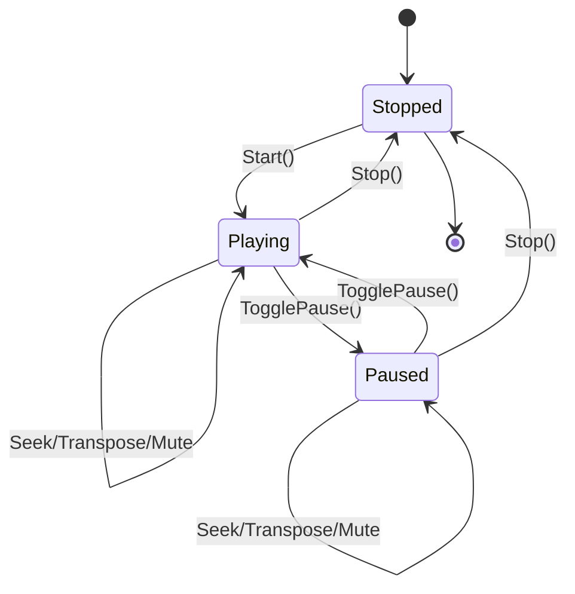
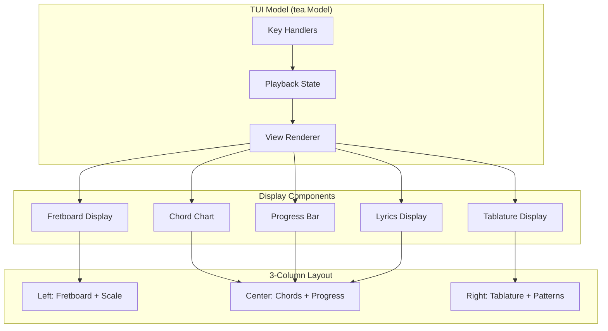
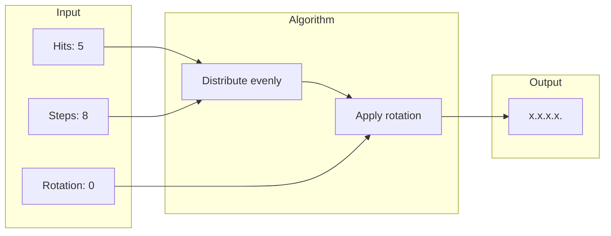
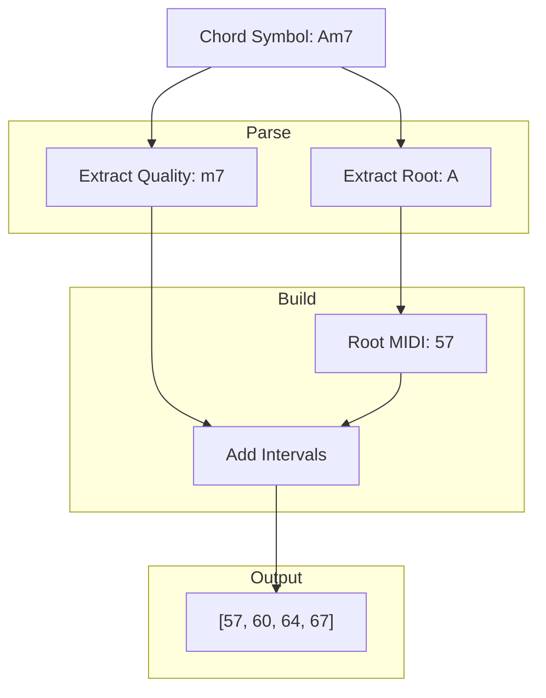
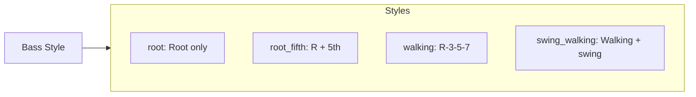
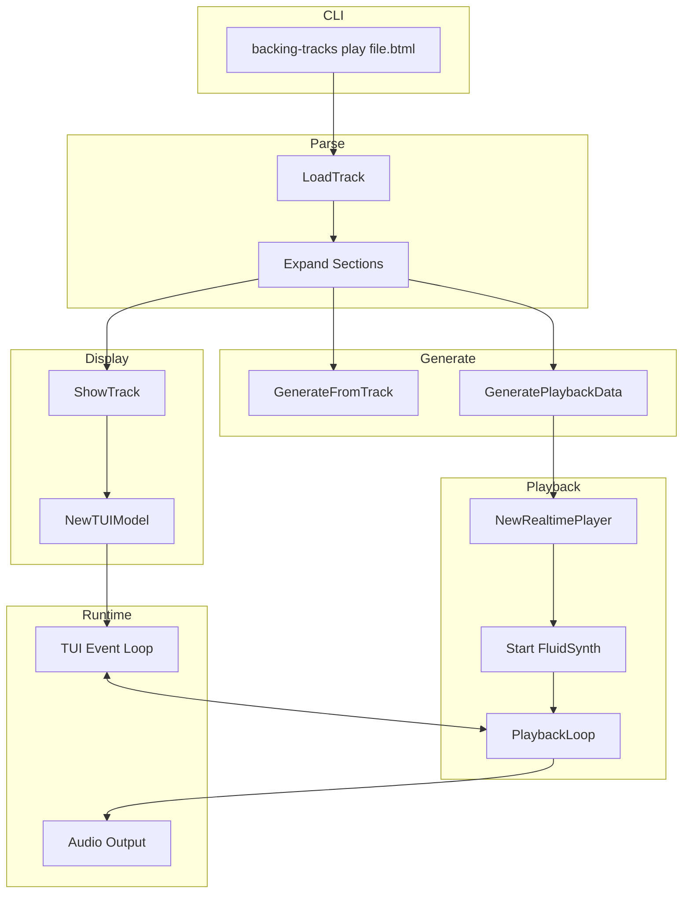

# Backing Tracks - Architecture Document

## Overview

**backing-tracks** is a terminal-based MIDI backing track player written in Go. It enables guitarists to create and play full-band backing tracks (drums, bass, chords, melody) from YAML-based BTML files, with real-time visualization using Bubbletea TUI and audio synthesis via FluidSynth.

**Version:** v0.6 | **Language:** Go 1.24

---

## Component Architecture



---

## Package Structure

```
backing-tracks/
├── main.go                    # CLI entry point
├── parser/                    # BTML parsing
│   ├── parser.go              # Core data model & YAML parsing
│   └── lyrics.go              # Beat-mapped lyrics parsing
├── midi/                      # MIDI generation
│   ├── generator.go           # Orchestrator
│   ├── rhythm.go              # Chord rhythm patterns
│   ├── bass.go                # Bass line generation
│   ├── drums.go               # Drum patterns (incl. Euclidean)
│   ├── melody.go              # Melody generation
│   ├── patterns.go            # Fingerstyle pattern library
│   ├── voicings.go            # Guitar chord voicings
│   ├── realtime.go            # Real-time playback data
│   └── tablature.go           # Tablature generation
├── display/                   # User interface
│   ├── tui.go                 # Bubbletea TUI model
│   ├── fretboard.go           # Fretboard visualization
│   ├── chords.go              # Chord chart display
│   ├── tablature.go           # Tablature display
│   └── live.go                # Legacy ANSI display
├── player/                    # Audio playback
│   ├── fluidsynth.go          # FluidSynth integration
│   └── realtime.go            # Real-time player control
├── theory/                    # Music theory
│   └── theory.go              # Scales, tunings, intervals
└── strudel/                   # Export
    └── generator.go           # Strudel.cc export
```

---

## Data Model



---

## MIDI Generation Pipeline



### MIDI Track Configuration

| Track | Channel | Program | Content |
|-------|---------|---------|---------|
| 0 | - | - | Tempo metadata |
| 1 | 0 | Piano (0) | Chord voicings |
| 2 | 1 | Fingered Bass (33) | Bass notes |
| 3 | 9 | GM Drums | Drum hits |
| 4 | 2 | Steel Guitar (25) | Melody |

### Timing Constants

```go
TICKS_PER_QUARTER = 480    // Standard MIDI resolution
TICKS_PER_BAR     = 1920   // 4 quarters × 480 (4/4 time)
```

---

## Real-Time Playback Architecture



### Player State Machine



---

## TUI Display Architecture



### Keyboard Controls

| Key | Action |
|-----|--------|
| Space | Pause/Resume |
| ←/→ | Seek by 1 bar |
| ↑/↓ | Transpose semitone |
| Shift+↑/↓ | Adjust tempo ±5 BPM |
| [/] | Adjust capo (with audio transpose) |
| {/} | Visual capo only (no audio change) |
| </> | Cycle through tunings |
| 1-5 | Mute track (1=drums, 2=bass, 3=chords, 4=melody, 5=fingerstyle) |
| Shift+1-9 | Loop N bars from current position |
| Shift+0 | Loop current section |
| ;/' | Cycle fingerstyle pattern |
| l | Toggle lyrics display |
| m | Toggle metronome/beat counter |
| s | Toggle strum pattern display |
| t | Toggle inline tablature |
| c | Toggle chord names display |
| e | Enter lyrics edit mode |
| q | Quit |

### Lyrics Edit Mode (when in edit mode)

| Key | Action |
|-----|--------|
| ← | Select previous word |
| → | Select next word |
| Shift+← | Move selected word one beat earlier |
| Shift+→ | Move selected word one beat later |
| Enter | Save changes and exit edit mode |
| Esc | Discard changes and exit edit mode |

---

## Key Algorithms

### 1. Euclidean Rhythm (Bjorklund's Algorithm)

Distributes N hits evenly across M steps. Used for drum patterns.



**Example patterns:**
- `(3, 8, 0)` → `x..x..x.` (Tresillo)
- `(5, 8, 0)` → `x.x.x.x.` (Cinquillo)
- `(4, 12, 0)` → `x..x..x..x..` (Triplet feel)

### 2. Swing Implementation

Adjusts timing of off-beat notes for swing feel.

```
Swing ratio: 0.5 = straight, 0.67 = triplet swing

Straight (0.5):   |----|----|----|----|
                  1    2    3    4

Swing (0.67):     |------|----|------|----|
                  1      2    3      4
```

### 3. Chord Voicing Generation



**Interval mappings:**
| Quality | Intervals (semitones) |
|---------|----------------------|
| Major | 0, 4, 7 |
| Minor (m) | 0, 3, 7 |
| Dominant 7 | 0, 4, 7, 10 |
| Major 7 | 0, 4, 7, 11 |
| Minor 7 | 0, 3, 7, 10 |
| Power (5) | 0, 7, 12 |

### 4. Bass Line Generation



### 5. Beat-Mapped Lyrics Parsing

Parses Beatles-style chord/beat notation:

```
Input:
  Am   /    /    /    G    /    /    /
  Words placed un-der beats where sung

Output:
  BeatLyric{Bar:0, Beat:0, Chord:"Am", Lyrics:"Words"}
  BeatLyric{Bar:0, Beat:1, Chord:"",   Lyrics:"placed"}
  BeatLyric{Bar:0, Beat:2, Chord:"",   Lyrics:"un-der"}
  BeatLyric{Bar:0, Beat:3, Chord:"",   Lyrics:"beats"}
  BeatLyric{Bar:1, Beat:0, Chord:"G",  Lyrics:"where"}
  ...
```

---

## Data Flow: Complete Execution



---

## Dependencies

### Go Modules

```go
require (
    github.com/charmbracelet/bubbletea v1.3.10   // TUI framework
    github.com/charmbracelet/lipgloss v1.1.0     // Terminal styling
    gitlab.com/gomidi/midi/v2 v2.3.18            // MIDI generation
    golang.org/x/term v0.38.0                    // Terminal utilities
    gopkg.in/yaml.v3 v3.0.1                      // YAML parsing
)
```

### External

- **FluidSynth** - Software synthesizer for MIDI playback
- **SoundFont (.sf2)** - Instrument samples (e.g., FluidR3_GM.sf2)

---

## Technical Decisions

| Decision | Rationale |
|----------|-----------|
| YAML for BTML | LLM-friendly, human-readable, supports comments |
| MIDI intermediate format | Portable, inspectable, DAW-compatible |
| FluidSynth | High-quality synthesis, low CPU, cross-platform |
| Bubbletea TUI | Composable components, keyboard-driven |
| Real-time player | Enables seeking, transposing, muting during playback |
| Euclidean rhythms | Mathematically interesting, easy to parameterize |
| 480 ticks/quarter | Standard MIDI resolution for precise timing |

---

## Limitations

1. **4/4 time only** - Other time signatures not yet supported
2. **Single tempo** - No tempo changes mid-song
3. **Terminal-only** - No GUI (intentional design choice)
4. **Linux-focused** - Primary testing on Linux (should work on macOS)

---

## Code Statistics

- **Total Go lines:** ~12,000
- **Packages:** 8
- **Source files:** 22
- **Types defined:** 50+
- **Key interfaces:** tea.Model, PlayerController
