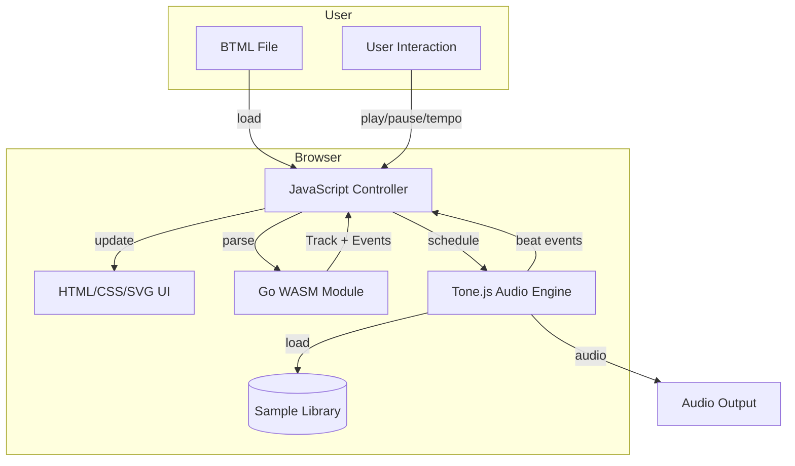
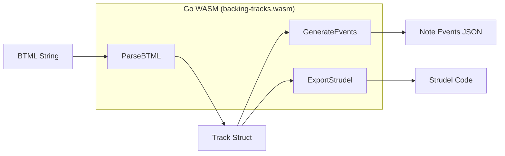
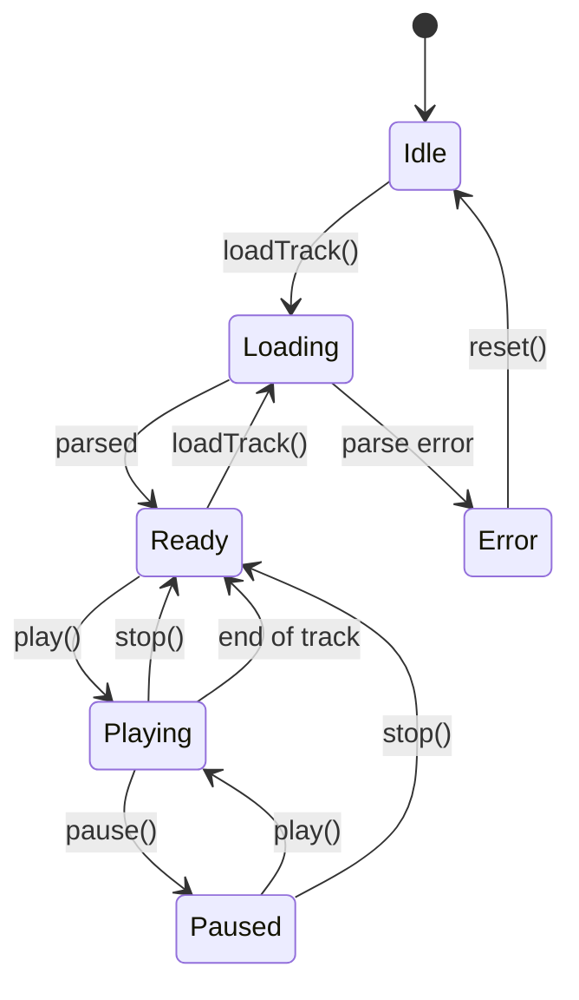
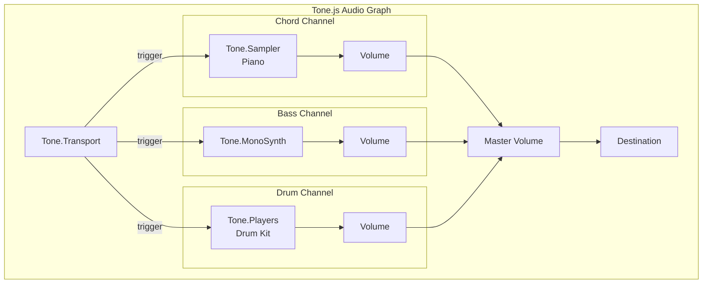
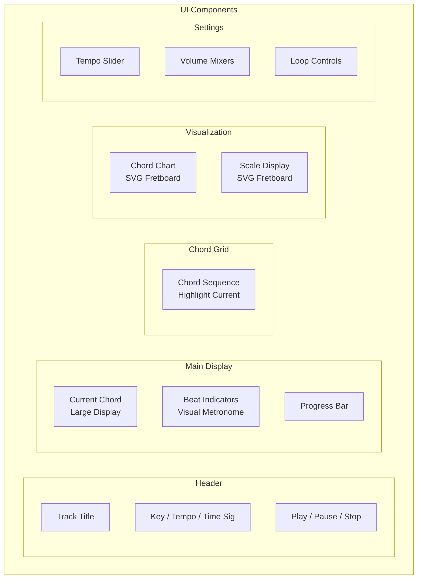
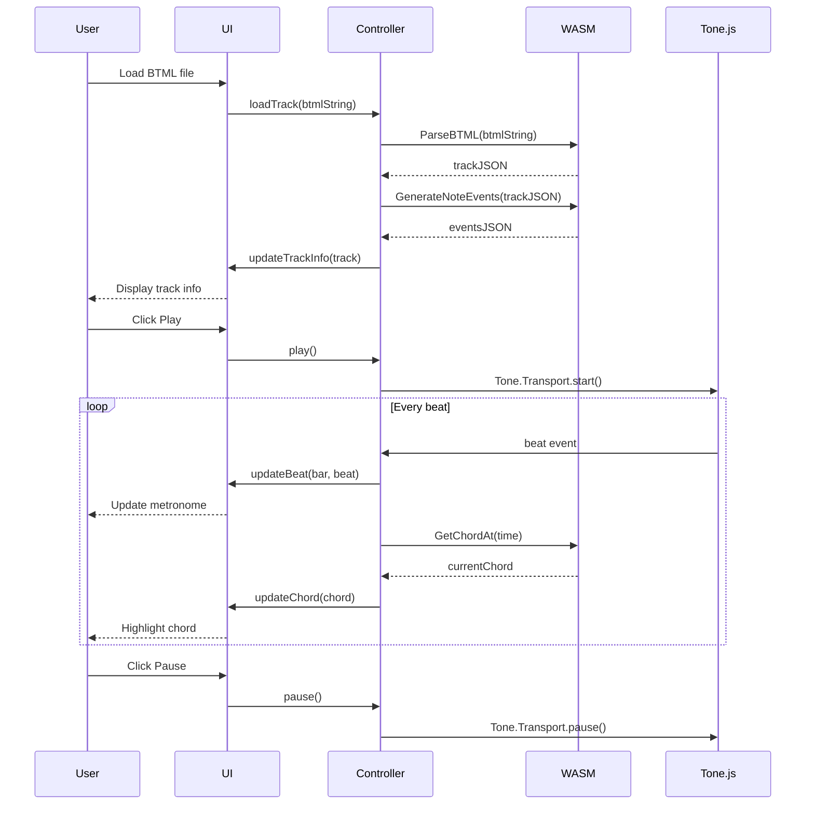
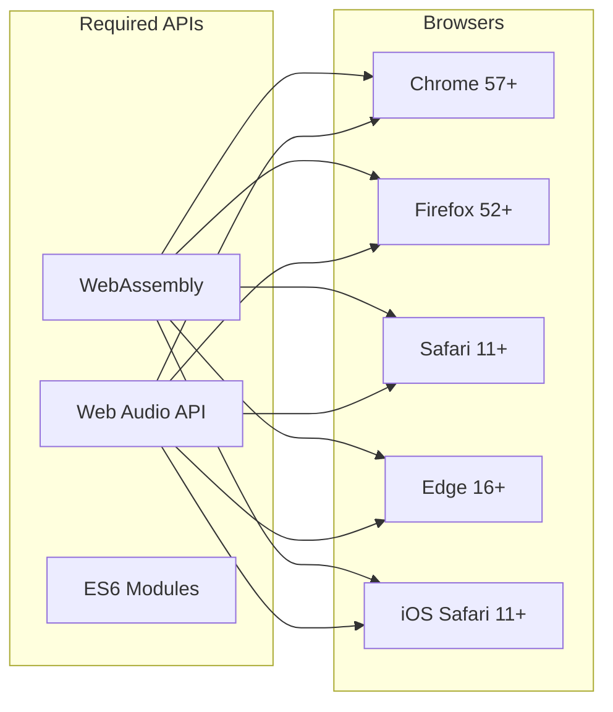
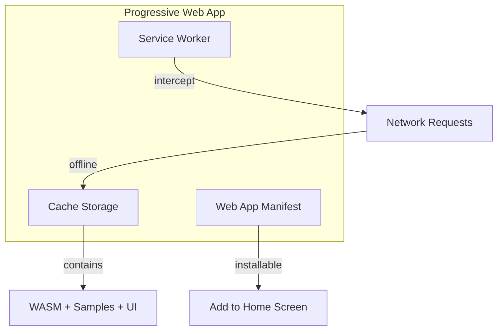
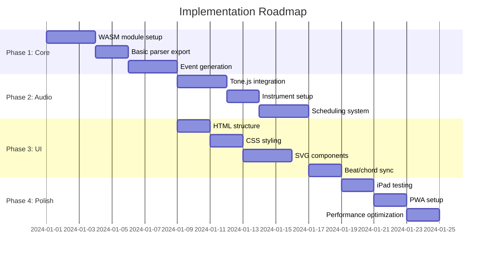

# Web Version Proposal: Backing Tracks Player

**Version:** 1.0
**Date:** 2024-12-24
**Status:** Proposal

## Executive Summary

This document proposes an architecture for a browser-based version of the Backing Tracks player that works on desktop browsers and iPadOS. The solution uses Go compiled to WebAssembly for parsing and MIDI generation, combined with Tone.js for audio synthesis.

## Goals

1. **Cross-platform**: Run in modern browsers (Chrome, Firefox, Safari, Edge)
2. **iPad support**: Full functionality on iPadOS Safari
3. **Code reuse**: Share BTML parsing logic with CLI version
4. **Small footprint**: < 5MB total download size
5. **Offline capable**: Work as a PWA after initial load
6. **Low latency**: Responsive playback with accurate timing

## High-Level Architecture



## Component Architecture

### 1. Go WebAssembly Module

The Go code compiles to WASM, exposing functions for parsing and event generation.



**Exported Functions:**

| Function | Input | Output | Description |
|----------|-------|--------|-------------|
| `ParseBTML` | YAML string | Track JSON | Parse BTML to track structure |
| `GenerateNoteEvents` | Track JSON | Events JSON | Generate timed note events |
| `GetChordAt` | Track JSON, time | Chord string | Get chord at specific time |
| `ExportStrudel` | Track JSON | Strudel code | Export to Strudel format |

**Note Event Format:**

```json
{
  "events": [
    {
      "time": 0.0,
      "duration": 1.0,
      "type": "chord",
      "notes": [60, 64, 67, 70],
      "velocity": 80
    },
    {
      "time": 0.0,
      "duration": 0.5,
      "type": "bass",
      "notes": [36],
      "velocity": 100
    },
    {
      "time": 0.0,
      "duration": 0.25,
      "type": "drum",
      "drum": "kick",
      "velocity": 100
    }
  ],
  "duration": 48.0,
  "tempo": 80
}
```

### 2. JavaScript Controller

Bridges the WASM module and audio engine, manages playback state.



**Controller Responsibilities:**

- Initialize WASM module
- Load and parse BTML files
- Schedule audio events with Tone.js
- Handle transport controls (play, pause, stop, seek)
- Emit UI update events (current beat, chord changes)
- Manage tempo changes during playback

### 3. Audio Engine (Tone.js)



**Instrument Choices:**

| Voice | Tone.js Component | Sample Size | Notes |
|-------|-------------------|-------------|-------|
| Chords | `Tone.Sampler` (Piano) | ~2MB | Salamander Grand Piano (subset) |
| Bass | `Tone.MonoSynth` | 0KB | Synthesized, no samples needed |
| Drums | `Tone.Players` | ~1MB | Minimal kit: kick, snare, hihat, ride |

**Scheduling Strategy:**

```javascript
// Lookahead scheduling for sample-accurate timing
Tone.Transport.scheduleRepeat((time) => {
  // Schedule events slightly ahead
  const lookAhead = 0.1; // 100ms
  const events = getEventsInWindow(time, time + lookAhead);

  events.forEach(event => {
    switch(event.type) {
      case 'chord':
        piano.triggerAttackRelease(event.notes, event.duration, event.time);
        break;
      case 'bass':
        bass.triggerAttackRelease(event.notes[0], event.duration, event.time);
        break;
      case 'drum':
        drums.player(event.drum).start(event.time);
        break;
    }
  });
}, "16n"); // Check every 16th note
```

### 4. User Interface



**Technology Choices:**

| Component | Technology | Rationale |
|-----------|------------|-----------|
| Layout | HTML + CSS Grid | Simple, responsive |
| Styling | CSS Custom Properties | Theming, dark mode |
| Animations | CSS Transitions | GPU accelerated |
| Chord Charts | SVG | Vector, scalable |
| Scale Display | SVG | Reuse fretboard component |
| State Management | Vanilla JS | Simple app, no framework needed |

**UI Mockup (ASCII):**

```
┌─────────────────────────────────────────────────────┐
│  Blues in A                    ♩ 80 BPM  │  Key: A  │
├─────────────────────────────────────────────────────┤
│                                                     │
│                      A7                             │
│                                                     │
│              ◉    ○    ○    ○                       │
│              1    2    3    4                       │
│                                                     │
│  ▓▓▓▓▓▓▓▓▓▓▓▓▓▓▓░░░░░░░░░░░░░░  Bar 3/12          │
│                                                     │
├─────────────────────────────────────────────────────┤
│  ┌─────┐ ┌─────┐ ┌─────┐ ┌─────┐                   │
│  │ A7  │ │ A7  │ │ A7  │ │ A7  │                   │
│  └─────┘ └─────┘ └─────┘ └─────┘                   │
│  ┌─────┐ ┌─────┐ ┌─────┐ ┌─────┐                   │
│  │ D7  │ │ D7  │ │[A7] │ │ A7  │  ← current       │
│  └─────┘ └─────┘ └─────┘ └─────┘                   │
│  ┌─────┐ ┌─────┐ ┌─────┐ ┌─────┐                   │
│  │ E7  │ │ D7  │ │ A7  │ │ E7  │                   │
│  └─────┘ └─────┘ └─────┘ └─────┘                   │
├─────────────────────────────────────────────────────┤
│  [Chord Chart: A7]           [Scale: A Mixolydian] │
│   ┌─┬─┬─┬─┬─┐                 ┌─┬─┬─┬─┬─┐         │
│   │ │ │●│ │ │ 1              ○│ │●│ │●│ │ 5       │
│   ├─┼─┼─┼─┼─┤                 ├─┼─┼─┼─┼─┤         │
│   │●│ │ │●│ │ 2              ●│ │ │●│ │●│ 7       │
│   └─┴─┴─┴─┴─┘                 └─┴─┴─┴─┴─┘         │
├─────────────────────────────────────────────────────┤
│  [▶ Play] [⏸ Pause] [⏹ Stop]    Tempo: [====●==]  │
│  Chords: [====●==]  Bass: [====●==]  Drums: [●===] │
└─────────────────────────────────────────────────────┘
```

## File Structure

```
web/
├── index.html              # Main HTML file
├── manifest.json           # PWA manifest
├── sw.js                   # Service worker (offline)
├── css/
│   ├── main.css            # Core styles
│   ├── components.css      # UI components
│   └── themes.css          # Light/dark themes
├── js/
│   ├── app.js              # Application entry point
│   ├── controller.js       # Playback controller
│   ├── wasm-bridge.js      # Go WASM interface
│   ├── audio-engine.js     # Tone.js wrapper
│   ├── ui.js               # UI updates
│   └── components/
│       ├── chord-grid.js   # Chord grid component
│       ├── metronome.js    # Beat indicator
│       ├── fretboard.js    # SVG fretboard renderer
│       └── transport.js    # Play/pause controls
├── wasm/
│   └── backing-tracks.wasm # Compiled Go module
├── samples/
│   ├── piano/              # Piano samples (~2MB)
│   │   ├── A3.mp3
│   │   ├── C4.mp3
│   │   └── ...
│   └── drums/              # Drum samples (~1MB)
│       ├── kick.mp3
│       ├── snare.mp3
│       ├── hihat-closed.mp3
│       ├── hihat-open.mp3
│       └── ride.mp3
└── examples/               # Example BTML files
    ├── blues-a.btml
    └── jazz-swing.btml
```

## Data Flow



## Go WASM Implementation

### Changes to Existing Code

The existing Go code needs minimal changes:

1. **Build tag for WASM:**

```go
//go:build js && wasm

package main

import (
    "encoding/json"
    "syscall/js"
    "backing-tracks/parser"
    "backing-tracks/midi"
)
```

2. **Export functions to JavaScript:**

```go
func main() {
    // Register functions
    js.Global().Set("BackingTracks", js.ValueOf(map[string]interface{}{
        "parseBTML":           js.FuncOf(parseBTML),
        "generateNoteEvents":  js.FuncOf(generateNoteEvents),
        "getChordAt":          js.FuncOf(getChordAt),
        "exportStrudel":       js.FuncOf(exportStrudel),
    }))

    // Keep the program running
    select {}
}

func parseBTML(this js.Value, args []js.Value) interface{} {
    btmlString := args[0].String()

    track, err := parser.ParseString(btmlString)
    if err != nil {
        return map[string]interface{}{"error": err.Error()}
    }

    jsonBytes, _ := json.Marshal(track)
    return string(jsonBytes)
}
```

3. **Build command:**

```bash
GOOS=js GOARCH=wasm go build -o web/wasm/backing-tracks.wasm ./cmd/wasm
```

### New Files Required

| File | Purpose |
|------|---------|
| `cmd/wasm/main.go` | WASM entry point |
| `parser/parse_string.go` | Parse from string (not file) |
| `midi/events.go` | Generate events (not MIDI file) |

## Browser Compatibility



**iPad-Specific Considerations:**

1. **Audio Context**: Must be created after user gesture (tap)
2. **Screen Size**: Responsive layout for portrait/landscape
3. **Touch Events**: Large touch targets for controls
4. **No Hover States**: Use active states instead

## PWA Features



**Cached Resources:**
- `backing-tracks.wasm` (~2MB)
- Piano samples (~2MB)
- Drum samples (~1MB)
- CSS/JS (~100KB)
- **Total: ~5MB**

## Implementation Phases



## Phase Details

### Phase 1: Core WASM Module

**Deliverables:**
- Go WASM build configuration
- `ParseBTML()` function exported
- `GenerateNoteEvents()` function exported
- JavaScript bridge module
- Unit tests for parser

### Phase 2: Audio Engine

**Deliverables:**
- Tone.js integration
- Piano sampler with minimal sample set
- Synthesized bass voice
- Drum sample player
- Transport controls (play, pause, stop)
- Tempo adjustment

### Phase 3: User Interface

**Deliverables:**
- Responsive HTML layout
- CSS styling with dark mode
- SVG fretboard component
- Chord grid with highlighting
- Visual metronome
- Progress bar
- Volume controls

### Phase 4: Polish & PWA

**Deliverables:**
- Service worker for offline use
- Web app manifest
- iPad touch optimization
- Performance profiling
- Cross-browser testing

## Technical Risks & Mitigations

| Risk | Impact | Mitigation |
|------|--------|------------|
| WASM size too large | Slow load | Tree-shake unused code, lazy load |
| Audio latency on iPad | Poor UX | Use Tone.js buffer scheduling |
| Sample download time | Slow start | Progressive loading, show progress |
| Safari audio restrictions | No sound | Clear "tap to start" UI |
| Go WASM memory leaks | Crashes | Careful lifecycle management |

## Alternatives Considered

### Full JavaScript Rewrite

**Pros:**
- No WASM complexity
- Smaller bundle size
- Easier debugging

**Cons:**
- Duplicate parsing logic
- Two codebases to maintain
- Can't share bug fixes

**Decision:** Rejected. Code reuse outweighs complexity.

### Emscripten + FluidSynth WASM

**Pros:**
- Identical sound to CLI version
- Full SoundFont support

**Cons:**
- FluidSynth WASM is ~5MB
- SoundFont files are 150MB+
- Complex build process

**Decision:** Rejected. Too heavy for web.

### WebMIDI + External Synth

**Pros:**
- No synthesis in browser
- Works with hardware

**Cons:**
- Requires MIDI device
- Not portable to iPad
- Complex setup for users

**Decision:** Rejected. Not accessible enough.

## Success Metrics

1. **Load time**: < 3 seconds on 4G connection
2. **Time to first sound**: < 1 second after play pressed
3. **Audio latency**: < 50ms perceived
4. **Offline support**: Full functionality after first load
5. **iPad compatibility**: All features work on Safari iOS

## Conclusion

The proposed hybrid architecture (Go WASM + Tone.js + HTML/SVG) provides the best balance of:

- **Code reuse** with the CLI version
- **Small download size** (~5MB)
- **Cross-platform support** including iPadOS
- **Good audio quality** via Tone.js
- **Maintainability** with clear separation of concerns

The implementation can be completed in four phases, with a working prototype possible after Phase 2.
